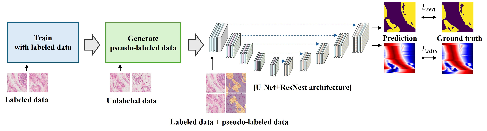

# Self-Training with Signed Distance Maps for Enhanced Tumor Boundary Segmentation in Histopathology

## Description
</img> 
We propose a self-training-based pseudo labeling to address the scarcity of annotated histopathology data. Further, the proposed architecture incorporates the concept of the Signed Distance Map (SDM) to facilitate robust boundary learning in complex pathological structures. 

Examples are shown below. The proposed method accurately captures complex boundaries, especially in ther lower-right area of each samples.
</img> 
## Environment Setup

    conda env create -f pseudo-u.yaml
    conda activate pseudo-u

## Data setup
This paper conducts experiments on customized breast cancer dataset.
## Usage
Follow the semi_sdm_unet.py
